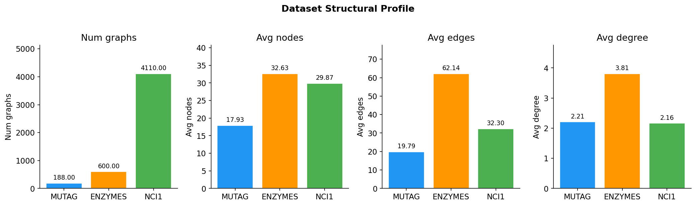

# LWG-Project Setup Guide

> **Note:** This repository uses separate branches for different encodings.
Please switch to the appropriate branch before running the code
to reproduce each encoding.

## Setup Guide

### 1. Create a Conda Environment

```bash
conda create -n graphgps python=3.10 -y
conda activate graphgps
```

### 2. Install Core Dependencies

Install RDKit, OpenBabel, and fsspec from conda-forge:

```bash
conda install -c conda-forge rdkit openbabel fsspec -y
```

### 3. Install PyTorch

Install the CUDA 12.1 build of PyTorch:

```bash
pip install torch==2.5.1 torchvision torchaudio --index-url https://download.pytorch.org/whl/cu121
```

### 4. Install PyTorch Geometric Dependencies

```bash
pip install torch_scatter torch_sparse torch_cluster torch_spline_conv -f https://data.pyg.org/whl/torch-2.5.1+cu121.html
pip install torch-geometric
```

### 5. Install Remaining Python Packages

```bash
pip install pytorch-lightning hyper-connections torch-einops-utils yacs torchmetrics performer-pytorch tensorboardX ogb wandb
```

### 6. Downgrade scikit-learn

The project was originally implemented with an older scikit-learn API. To avoid compatibility issues, install a version below 1.6.0:

```bash
pip install "scikit-learn<1.6.0"
```

### 7. Verify the Installation

Run the following command from inside the `GraphGPS` directory:

```bash
python main.py --cfg configs/GPS/zinc-GPS+RWSE.yaml wandb.use False optim.max_epoch 1
```

If the setup is successful, the training script should start without dependency or import errors.


## Dataset Profile


